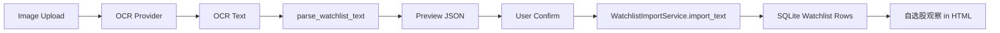

# OCR Watchlist Import v0.3c Design

## Goal

Add image-based watchlist import so a user can upload a screenshot, review OCR-recognized stock codes, and explicitly confirm before the recognized symbols become the latest local watchlist used by daily HTML reports.

The generated HTML report remains the product's north star. OCR is an ingestion enhancement: it improves the data entering `自选股观察` without changing the report generation contract or making the HTML depend on image assets.

## User Flow

1. User opens the existing `自选股导入` panel.
2. User uploads a `.png`, `.jpg`, `.jpeg`, or `.webp` screenshot.
3. Backend stores the original image under the local watchlist snapshot directory.
4. OCR provider extracts text from the image.
5. Backend parses extracted text with the existing `parse_watchlist_text` parser.
6. Frontend shows a preview containing recognized text, parsed symbols, warnings, and OCR provider status.
7. User clicks `确认导入`.
8. Backend persists the recognized text through the existing watchlist import path, creating the latest watchlist import and item rows.
9. Future close reports use that latest watchlist and render it in `自选股观察` as they already do.

## Scope

### In Scope

- Image upload endpoint for OCR preview.
- Confirm endpoint that converts a preview into a normal watchlist import.
- Local snapshot persistence for original image, OCR text, and parsed preview JSON.
- Fake OCR provider for deterministic tests and local offline development.
- OpenAI-compatible vision OCR provider using existing API-style configuration.
- Frontend upload UI in the current watchlist panel.
- Tests for parser reuse, preview storage, confirmation persistence, and frontend API types.
- README and `.env.example` updates.

### Out of Scope

- Auto-import immediately after OCR.
- Cropping, rotation, or manual bounding-box editing.
- Full side-by-side image/text correction workbench.
- Displaying OCR source images inside the generated HTML report.
- Persisting real API keys in repo files, snapshots, generated assets, or logs.

## Architecture

OCR is implemented as a separate ingestion layer before the existing watchlist import service.

This keeps the current watchlist parser and persistence path authoritative. OCR never writes to SQLite by itself; only the confirmation step does.

## Backend Design

### OCR Provider Interface

Create a small provider boundary returning extracted text plus metadata:

- `OcrProvider.extract_text(image_bytes, mime_type, filename) -> OcrExtractResult`
- `OcrExtractResult.text`: extracted plain text.
- `OcrExtractResult.provider`: provider name such as `fake` or `openai`.
- `OcrExtractResult.status`: `success` or `fallback`.
- `OcrExtractResult.message`: human-readable diagnostic.

Provider modes:

- `OCR_PROVIDER=fake`: deterministic text for tests and offline development.
- `OCR_PROVIDER=openai`: OpenAI-compatible vision request using local environment values.
- `OCR_FALLBACK_ENABLED=true`: failed real OCR falls back to fake, preserving local MVP behavior.

### Preview Service

Create a service dedicated to OCR previews:

- Saves original image under `WATCHLIST_SNAPSHOT_ROOT/ocr/<preview_id>-original.<ext>`.
- Saves OCR text under `WATCHLIST_SNAPSHOT_ROOT/ocr/<preview_id>-ocr.txt`.
- Saves parsed preview JSON under `WATCHLIST_SNAPSHOT_ROOT/ocr/<preview_id>-preview.json`.
- Returns `preview_id`, recognized text, parsed items, warnings, source paths, and provider status.

Preview IDs can be sequential files derived from existing snapshot contents. They do not need a new SQLite table for the MVP because a preview is not a committed watchlist. Confirmation can read the preview JSON from disk and then call the current import service.

### API Endpoints

Add two endpoints:

- `POST /api/watchlists/ocr-preview`
  - Multipart form field: `file`.
  - Accepts image MIME types only.
  - Returns OCR preview result without writing watchlist import rows.

- `POST /api/watchlists/ocr-confirm`
  - JSON body: `{ "preview_id": "..." }`.
  - Reads stored preview text.
  - Calls `WatchlistImportService.import_text(text, source_name="ocr:<filename>")`.
  - Returns the same `WatchlistImportResult` shape used by text/file imports.

## Frontend Design

Extend `WatchlistImportPanel` with a third import path:

- File picker labeled `上传截图识别`.
- Supported image types: `.png,.jpg,.jpeg,.webp,image/png,image/jpeg,image/webp`.
- On upload, call OCR preview endpoint and render:
  - OCR status.
  - Recognized stock symbols.
  - Warnings.
  - A collapsed or compact recognized text block.
  - `确认导入` button.
- On confirm, call OCR confirm endpoint and reuse the existing `onImported(result)` flow.

The panel should remain compact because the page is primarily a report generation workspace, not an OCR editor.

## Error Handling

- Unsupported file type returns HTTP 400 with a clear message.
- OCR provider failures return fallback data when fallback is enabled.
- OCR provider failures return HTTP 502 when fallback is disabled.
- Empty OCR text returns a preview with zero items and a warning; it does not write to SQLite.
- Confirming a missing preview returns HTTP 404.
- Confirming a zero-item preview is allowed but returns `item_count=0`; frontend should still show warnings.

## Data and Secret Policy

- Real API keys are only read from environment variables.
- API keys are never included in generated snapshots, HTML, PNG, JSON, tests, docs, or logs.
- Original uploaded images are local artifacts under the configured watchlist snapshot directory.
- Generated report HTML does not embed OCR images.

## Testing Plan

- Unit test MIME validation and preview file persistence.
- Unit test fake OCR preview reuses `parse_watchlist_text` and deduplicates symbols.
- API test `ocr-preview` returns preview but does not create watchlist import rows.
- API test `ocr-confirm` creates watchlist import rows and updates latest watchlist.
- API test unsupported image MIME returns 400.
- Frontend type check covers new API helpers and component state.
- Existing report tests continue to prove HTML generation consumes latest watchlist through the unchanged path.

## Acceptance Criteria

- User can upload a screenshot and see parsed stock candidates before committing them.
- User can confirm the preview and make it the latest watchlist.
- Generated HTML reports include OCR-imported watchlist symbols in `自选股观察` through the existing report path.
- No OCR preview writes to SQLite until explicit confirmation.
- All existing backend and frontend checks pass.
- No real TickFlow, Anspire, OpenAI, or OCR keys are written to the repository.
